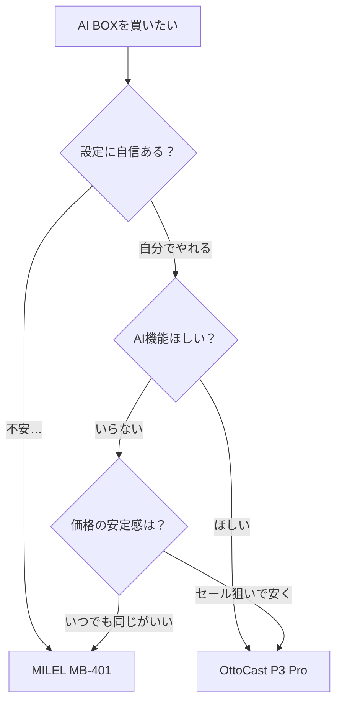

+++
date = '2026-02-26'
draft = false
title = 'OttoCast vs MILEL｜AI BOXの違いを徹底比較'
style = 'C'
description = 'OttoCastとMILELのAI BOXを徹底比較。OEM関係でスペックはほぼ同じ2製品の違いは、サポート・独自機能・プリインアプリにあります。P3 ProとMB-401の選び方を解説します。'
slug = 'ottocast-milel-comparison'
image = 'cover.jpg'
categories = ['まとめ']
tags = ['AI BOX', 'カー用品', 'OttoCast', 'MILEL', 'CarPlay']
keywords = ['AI BOX おすすめ', 'OttoCast MILEL 違い', 'AI BOX 比較', 'P3 Pro MB-401', 'CarPlay Android化', 'AI BOX 選び方']
+++

※この記事にはアフィリエイト広告が含まれています。

## 車で YouTube が見たい──AI BOX、気になってませんか？

「車の中で YouTube や Netflix が観られたらいいのに」──こんなこと、一度は思ったことありませんか？

カーナビの画面で動画を再生したり、Google マップをそのまま使えたりする **AI BOX**。ここ最近かなり注目されていて、CarPlay 対応の車ならポートに挿すだけで Android 環境が使えるようになるデバイスです。

で、AI BOX を調べ始めると必ず目にするのが **OttoCast** と **MILEL** の 2 ブランド。「どっちがいいの？」「何が違うの？」って迷いますよね。

<!-- TODO: 実体験 — 自分がMILELを選んだきっかけ・経緯を追記 -->

この記事では、両ブランドの OEM 関係から、スペック・サポート・プリインアプリ・独自機能まで、**実際に違いが出るポイント**を徹底比較します。先に結論を言うと、迷ったら **MILEL** がおすすめです。その理由を詳しく解説していきますね。

## そもそも AI BOX って何？

AI BOX は、**車の純正 CarPlay を Android 化するデバイス**です。USB 端子に接続するだけで、カーナビの画面が Android タブレットのように使えるようになります。

具体的にできることはこんな感じです:

- **YouTube / Netflix / Amazon Prime Video** を車の画面で再生
- **Google マップ**をカーナビ代わりに使う
- Google Play から好きなアプリを自由にインストール
- SIM カードを挿して単体で通信（スマホのテザリング不要）

「CarPlay があるなら十分じゃない？」と思うかもしれませんが、CarPlay だと使えるアプリがかなり限られるんですよね。YouTube は非対応だし、Netflix も見られません。AI BOX を使えば、**CarPlay の制限を超えて Android アプリが使い放題**になります。


AI BOX には**有線 CarPlay 対応の車**が必要です。ワイヤレス CarPlay のみ対応の車（一部 BMW・メルセデス等）では動作しない場合があるので、購入前にお使いの車の対応状況を確認してください。


## 2 ブランドの関係性──中身はほぼ同じです

比較する前に知っておいてほしいのが、この 2 ブランドの関係性です。

OttoCast は **AI BOX の先駆者**とも言えるブランドで、製品の企画・開発を行っています。一方 MILEL は、株式会社 qodo が日本市場向けに展開しているブランドで、[MILEL 公式サイト](https://qodo.co.jp/mb401)でも「**MILEL は OttoCast の OEM 製品**」「**基本的な内部基盤は同じ**」と明記されています。

つまり、**ハードウェアの土台は共通**なんです。同じチップセット、同じメモリ、同じストレージ。ベースが同じだから、性能面で大きな差は出ません。

じゃあ何が違うのか？ 本当に差が出るのは、**独自機能・サポート体制・付属アプリ**といった「使い勝手」の部分です。

## P3 Pro vs MB-401──スペックを並べてみた

2025 年末〜2026 年現在、両ブランドのフラッグシップモデルがこちらです。

{{< product-comparison
  title="AI BOX フラッグシップ比較"
  p1-name="OttoCast P3 Pro"
  p1-img="https://thumbnail.image.rakuten.co.jp/@0_mall/ottocaststore/cabinet/12580307/imgrc0115790300.jpg?_ex=300x300"
  p1-price="48,799〜69,799"
  p1-badge="本家"
  p1-specs="発売:2025年12月|SoC:Snapdragon 6225|RAM:8GB|ストレージ:128GB|OS:Android 13|通信:nanoSIM / Wi-Fi|映像出力:HDMI|拡張:MicroSD"
  p2-name="MILEL MB-401"
  p2-img="https://thumbnail.image.rakuten.co.jp/@0_mall/milel-carlife/cabinet/12734098/imgrc0114629980.jpg?_ex=300x300"
  p2-price="60,799"
  p2-badge="おすすめ"
  p2-specs="発売:2025年11月|SoC:Snapdragon 6225|RAM:8GB|ストレージ:128GB|OS:Android 12|通信:nanoSIM / Wi-Fi|映像出力:HDMI|拡張:MicroSD"
  highlight="2"
>}}

見ての通り、**主要スペックはほぼ同じ**です。SoC（Snapdragon 6225）、メモリ（8GB）、ストレージ（128GB）、通信方式（nanoSIM / Wi-Fi）──ハードウェアの基本性能に差はありません。

OS は P3 Pro が Android 13、MB-401 が Android 12 ですが、AI BOX としての使い勝手にはほぼ影響しません。セキュリティパッチの新しさくらいの差です。

価格は少し事情が違います。 は**セール時 48,799 円〜通常 69,799 円**とかなり変動があります。一方  は **60,799 円で安定**しているので、いつ買っても同じ金額なのは安心ですね。

<!-- TODO: 実体験 — 自分が購入したときの価格情報を追記 -->

## ここが決定的に違う──サポート・独自機能・アプリ

スペックがほぼ同じだからこそ、差がつくのは「使い勝手」の部分です。ここが選ぶときの最大のポイントになります。

### サポート体制

| | OttoCast | MILEL |
|---|---------|-------|
| 問い合わせ | メール（英語中心） | **LINE / メール（日本語）** |
| 対応速度 | 数日かかることも | LINE で即日対応あり |
| 日本語対応 | △ 翻訳ベース | ◎ ネイティブ |
| 保証 | 1 年間 | 1 年間 |

MILEL の最大の強みは **LINE サポート**です。初期設定でわからないことがあっても、LINE でサクッと聞けます。OttoCast は海外ブランドなのでメール対応が基本で、英語でのやり取りになることもあるんですよね。

<!-- TODO: 実体験 — LINEサポートに問い合わせたときのエピソードを追記 -->

### 独自機能

**OttoCast P3 Pro の独自機能:**

- **Gemini / ChatGPT** 内蔵で音声 AI 操作ができる
- **OttoDrive** で車両データ（速度・回転数・燃費等）をリアルタイム表示
- **CloudSIM 3.0** で海外でも SIM 不要で通信可能
- CES 2026 の Best of CES Award に選出（海外メディア）

**MILEL MB-401 の独自機能:**

- **音声操作**に対応（ハンズフリーで安全に操作。Gemini / ChatGPT の搭載有無は未公表）
- **広告スキップ**機能（YouTube 等の広告を自動スキップ）
- **7:3 分割画面**でナビを表示しながら動画を再生
OttoCast は AI 搭載や車両データ連携など**先進的な機能**が魅力ですね。一方 MILEL は広告スキップや分割画面など、**日常の便利さに直結する機能**が揃っています。

### プリインストールアプリ

ここも実は大きな違いなんですよね。

MILEL は**日本のユーザー向けにプリインアプリが充実**しています。YouTube、Netflix、Amazon Prime Video などが最初からセットアップされていて、箱から出してすぐ使い始められます。

OttoCast は基本的に **Google Play から自分でアプリをインストール**するスタイル。カスタマイズの自由度は高いですが、最初のセットアップには少し手間がかかります。

### 通信オプション

どちらも nanoSIM スロットと Wi-Fi テザリングに対応していますが、**追加の通信オプション**が異なります。

- **MILEL**: [y.u mobile](https://www.yumobile.jp/) SIM やモバイル Wi-Fi ルーターとのセット販売あり。通信手段を別途用意する手間が省ける
- **OttoCast**: CloudSIM 3.0 を内蔵。海外渡航時にも SIM を差し替えずに通信可能

国内メインで使うなら MILEL の SIM セット販売が手軽です。海外で車を使う機会がある方は OttoCast の CloudSIM が便利ですが、日本国内だけなら出番は少ないかもしれません。



## 迷ったらどっち？こんな人にはこちらがおすすめ

**MILEL MB-401 がおすすめな人:**

- AI BOX が初めてで、**設定やトラブルが不安**な人
- **日本語 LINE サポート**があると安心な人
- 広告スキップや分割画面など、**すぐ使える便利機能**がほしい人
- **価格が安定**しているほうがいい人（セール変動なし）
- お子さんを乗せることが多く、**サッと動画を再生**したい人

**OttoCast P3 Pro がおすすめな人:**

- ガジェット好きで、**自分好みにカスタマイズ**したい人
- **Gemini / ChatGPT** を車内で使いたい人
- **OttoDrive** で車両データを見たい人
- セール時の**割引価格**を狙える人


スペックがほぼ同じである以上、**初心者が安心して使えるのは MILEL** です。LINE サポート、日本語プリインアプリ、広告スキップ──面倒なことを減らしてくれる機能が揃っています。お子さんがいるご家庭なら、設定の手間なくすぐ使える MILEL のほうがストレスが少ないですよ。


## まとめ──AI BOX 選びで大切なこと

OttoCast と MILEL の AI BOX の違いを整理すると:

- **ハードウェア（SoC・メモリ・ストレージ）は OEM 関係でほぼ同じ**
- **MILEL は「すぐ使える安心感」** ── LINE サポート・プリインアプリ・広告スキップ
- **OttoCast は「先進性とカスタマイズ性」** ── Gemini/ChatGPT・OttoDrive・CloudSIM
- 初心者や子育て世代には **MILEL MB-401** がおすすめ

<!-- TODO: 実体験 — MILELを使ってみた総合的な感想を追記 -->

AI BOX は一度使うと車の過ごし方がガラッと変わります。特にお子さんがいると、後部座席で動画を流せるだけでドライブの快適さが段違いなんですよね。迷っている方は、まず  から始めてみてはいかがでしょうか。



