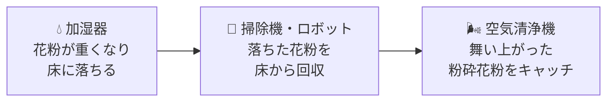

---
title: "在宅ワークの花粉症対策｜室内でも9割が症状あり"
date: 2026-02-25T00:00:00+09:00
draft: true
categories: ["解説"]
tags: ["花粉症", "花粉対策", "在宅ワーク", "テレワーク", "一戸建て", "お役立ち"]
description: "在宅ワークでも花粉症の症状が出る原因と室内の対策をまとめました。換気のコツや空気清浄機の使い方まで、フルリモート×子育てパパ目線で解説します。"
slug: "remote-work-pollen"
style: "F"
image: cover.jpg
---

在宅ワークだから花粉症は大丈夫……って思っていませんか？

自分はそう思ってたんですけど、調べてみたら全然そんなことなかったんですよね。**[一条工務店の調査](https://www.ichijo.co.jp/research/article/hay_fever/)によると、花粉症の人の9割以上が「自宅でも症状が出る」と回答している**そうです。さらに[パナソニックの調査（2020年）](https://prtimes.jp/main/html/rd/p/000000337.000024101.html)では、花粉症による労働力低下の経済損失額は**1日あたり約2,215億円**とも試算されています。在宅ワーカーにとって、これは見過ごせない数字です。

<!-- TODO: 実体験 — 上の子が鼻をこすり始めて「家の中の花粉、結構あるのかも」と気づいた具体的エピソード -->

自分自身は花粉症じゃないんですけど、5歳の上の子が最近やたらと鼻をすすっていて。「家の中にいるのになんで？」と思って調べてみたら、意外な事実がたくさん出てきました。

この記事では、**在宅ワーク中に花粉症の症状が出る原因と、今日からできる室内の花粉対策**をまとめています。子育て中のフルリモートワーカーの目線で書いていますが、一戸建てでも賃貸でも使える対策ばかりなので、在宅ワークの方はぜひ参考にしてみてください。

## 在宅ワークでも花粉症の症状が出るのはなぜ？

「外に出なければ花粉に触れない」というのは、実はかなり大きな誤解です。

自分は花粉症じゃないので正直あまり気にしてなかったんですけど、上の子が家の中にいるのに鼻をすすったり目をこすったりしているのを見て、「もしかして室内にも花粉って入ってくるの？」と気になって色々調べてみたんです。そしたら想像以上にヤバい数字が出てきました。

室内にいても花粉症の症状が出るのは、**家の中にかなりの量の花粉が侵入しているから**なんですよね。
[花王の研究データ](https://www.kao.co.jp/lifei/report/49/)によると、花粉シーズンの一般的な住宅では**1日あたり約2,000万個もの花粉が室内に入り込んでいる**そうです。花粉症の症状は20〜40個吸い込むだけで出るので、これはとんでもない量です。


しかも[パナソニックの研究](https://www.panasonic.com/global/consumer/nanoe/ja/topics/220307.html)で面白い（そして厄介な）ことがわかっていて、床に落ちた花粉の上を人が歩くと**花粉が粉砕されて「粉砕花粉」になる**んです。この粉砕花粉は通常の花粉よりはるかに小さいため、一度舞い上がると**3分以上も空気中を漂い続ける**とのこと。

つまり在宅ワーク中、自分が部屋の中を歩き回るだけでも花粉を粉砕して空中にばらまいている可能性があるということ。これは知らなかったです。

## 花粉が室内に侵入する主なルート

ここまで調べた時点で「じゃあそもそも花粉ってどこから入ってくるの？」と気になって、さらに深掘りしてみました。[花王の実測調査](https://www.kao.co.jp/lifei/report/49/)によると、侵入経路は大きく2つに分けられます。

| 侵入ルート | 割合 | 具体的にどうやって |
|:---:|:---:|---|
| **換気（窓・換気口）** | 約60% | 窓を開けた換気時、24時間換気の給気口から |
| **付着による持ち込み** | 約40% | 衣服・洗濯物・布団などに付着して室内へ |

**約6割が換気からの侵入**というのは衝撃的ですよね。在宅ワーク中に「空気入れ替えよう」と窓を開けた瞬間、大量の花粉を招き入れている可能性があるわけです。

ちなみに、侵入した花粉が最終的にどこにたまるかというと（[花王調べ](https://www.kao.co.jp/lifei/report/49/)）:

- **床**: 55%
- **布団**: 22%
- **洗濯物**: 15%

デスクの足元に花粉が溜まっていると考えると、ちょっとゾッとしますよね。

## 仕事に集中するための花粉対策5選

じゃあ具体的にどうすればいいのか。自分が調べて「これは効きそう」と思った対策をまとめました。

### 1. 掃除は朝イチ、水拭きから始める

夜のうちに床に落ちた花粉を、人が動き始める前に除去するのがポイントです。**いきなり掃除機をかけると花粉を巻き上げてしまう**ので、まず水拭きやクイックルワイパーで回収してから掃除機をかけるのが正解。

<!-- TODO: 実体験 — 朝の水拭きを始めてからの変化 -->

うちは朝の仕事前にリビングと書斎だけサッと拭くようにしてるんですけど、これだけでも上の子のくしゃみが減った気がします。5分もかからないので、けっこうおすすめです。

### 2. 部屋干しを徹底する

花粉シーズンは外干し厳禁です。外に干した洗濯物には花粉がびっしり付着して、取り込んだ瞬間に室内にばらまかれます。

部屋干しだと生乾き臭が心配ですけど、エアコンのドライ機能や扇風機を併用すれば十分乾きます。浴室乾燥機がある家は迷わず使いましょう。

### 3. 玄関で「水際対策」する

パナソニックの2026年調査によると、帰宅時に衣類の花粉を除去していない人が**約4割**もいるそうです。せっかく在宅ワークで花粉との接触を減らせていても、家族が花粉を持ち込んでしまったら意味がないですよね。

うちでやっていることはシンプルです:

- 玄関にハンガーラックを置いて、**上着はリビングに持ち込まない**
- 帰宅したらまず手洗い・洗顔
- 粘着テープ（コロコロ）を玄関に常備

<!-- TODO: 実体験 — 子供が保育園から帰ってきたときの対策ルーティン -->

### 4. 加湿器で湿度50%以上をキープ

花粉は空気中の水分を含むと重くなって床に落ちます。逆に**乾燥していると花粉がふわふわ舞い上がりやすくなる**んですよね。

湿度50%以上を目安にすると効果的です。ただし、**湿度が高すぎるとカビの原因になる**ので70%は超えないように注意してください。

加湿器がなければ、仕事部屋に濡れタオルを干すだけでもだいぶ違います。

### 5. 空気清浄機はデスク近くの床に置く

空気清浄機は**床に近い場所に置く**のがコツです。ダイキンによると、花粉は重いので床付近にたまりやすく、そこから吸い込むのが一番効率的だそうです。

選ぶときのポイントは「適用床面積」。部屋の**2〜3倍の適用床面積**を持つモデルを選ぶと、パワーに余裕があって素早く空気をきれいにしてくれます。

## 換気のタイミングと正しいやり方

花粉の侵入ルートの約6割が換気経由なので、ここを工夫するだけで状況はかなり改善します。

大事なのは**窓を開ける時間帯**です。花粉の飛散ピークは**昼〜夕方（だいたい13時〜15時）**。この時間帯の換気は避けて、**朝か夜**にしましょう。

それと、環境省の「[花粉症環境保健マニュアル2022](https://www.env.go.jp/chemi/anzen/kafun/2022_full.pdf)」にこんなデータがあります。


**窓を開ける幅10cm程度 + レースのカーテンだけで、花粉の侵入量を約1/4に減らせる**というデータがあります。全開にしなくても5〜10分で部屋の空気は入れ替わります。


24時間換気システムがある家は、給気口のフィルターを花粉対策用に替えるのも手ですね。ホームセンターや100均で花粉用フィルターが売っているので、シーズン中は1〜2ヶ月おきに交換するのがおすすめです。

## 空気清浄機と加湿器の活用術

この2つを組み合わせると、室内の花粉対策はぐっと効率的になります。

**仕組みはこんなイメージ**です:

「落とす → 拾う → 捕まえる」の3ステップを回すイメージですね。

空気清浄機を選ぶなら、**HEPAフィルター搭載**のものが花粉対策には効果的です。HEPAフィルターは0.3μmの微粒子を99.97%捕集できるスペックなので、花粉（約30μm）はもちろん、粉砕花粉にもしっかり対応できます。

個人的には、この「落とす→拾う」のステップでロボット掃除機が地味に活躍してくれてます。毎朝タイマーで動かしておけば、花粉が粉砕される前に床から回収してくれるので。花粉シーズンの床掃除を自動化したい方は、[ルンバミニの紹介記事](/posts/roomba-mini/)も参考にしてみてください。コンパクトで書斎にも置きやすいサイズ感です。

## 一戸建てならではの花粉侵入と対策

マンションに比べて一戸建ては**窓の数が圧倒的に多い**ので、それだけ花粉の侵入経路も増えます。

<!-- TODO: 実体験 — 積水ハウスの一戸建てで実際に感じた花粉の侵入しやすいポイント -->

自分も一戸建てに住んでるんですけど、1階だけでリビング・キッチン・書斎にそれぞれ窓があるので、ぶっちゃけ全部閉めっぱなしだと息苦しいんですよね。でも花粉の時期は開けるタイミングを選ばないと痛い目に遭います。

一戸建てで特に気をつけたいポイントをまとめておきます:

- **2階の窓**: 風通しが良い反面、花粉も入りやすい。飛散ピーク時は閉めておく
- **玄関の動線**: 一戸建ての広い玄関はコートかけスペースを作りやすい。上着を室内に持ち込まない導線を意識する
- **24時間換気の給気口**: フィルターを花粉対応タイプに交換する（1〜2ヶ月おき）
- **庭に面した窓**: 花粉の侵入リスクが高いので、レースのカーテンは必須

逆に一戸建てのメリットもあって、**浴室乾燥機やランドリールームがあれば部屋干しがしやすい**んですよね。花粉シーズンの洗濯に関しては、一戸建ての方がマンションより対策しやすい面もあると思います。

## 子供がいる家庭で気をつけたいこと

子供は大人よりも花粉の影響を受けやすいと言われています。理由はシンプルで:

- **地面に近い位置で遊ぶ**ので、床にたまった花粉を吸い込みやすい
- **遊びに夢中で顔を触る**ことが多く、目や鼻に花粉が入りやすい
- **鼻水だけだと風邪と見分けがつきにくい**ので、花粉症だと気づくのが遅れがち

<!-- TODO: 実体験 — 5歳の上の子の花粉症サインに気づいたきっかけ -->


うちの5歳の上の子、最近やたら目をこすっていて、最初は「疲れてるのかな」と思ってたんですよね。でも花粉の時期と重なってて、しかも外遊びした日に特にひどくなるパターンだったので、「これ花粉症かも」と。下の子は0歳なのでまだ大丈夫ですけど、上の子の様子を見ていると室内対策って大事だなと実感します。


子供がいる家庭で特にやっておきたいこと:

- **帰宅後すぐ手洗い・洗顔を習慣にする**（遊びの延長で楽しくやらせるのがコツ）
- **布団は外干ししない**。布団クリーナーか掃除機で花粉を吸い取る
- **寝室の空気清浄機**は優先度高め。布団に花粉が22%たまる（花王データ）ことを考えると、寝ている間の吸入を減らす効果は大きいです
- **目こすり・鼻すすりが2週間以上続いたら受診**。花粉症は早めに対策すると楽になります

## まとめ：在宅ワーカーこそ室内の花粉対策を

「在宅ワークだから花粉は関係ない」は大きな誤解でした。**室内の花粉対策こそが仕事の集中力を左右します**。

まずは「**朝の水拭き**」「**換気は朝か夜**」「**湿度50%キープ**」の3つから始めてみてください。これだけでもかなり違うはずです。

---

## 関連記事

- [ルンバミニの紹介記事](/posts/roomba-mini/) — 花粉シーズンの床掃除を自動化したい方に
- [浄水器の選び方ガイド](/posts/water-purifier-guide/) — 在宅ワーク環境をもっと快適にしたい方に