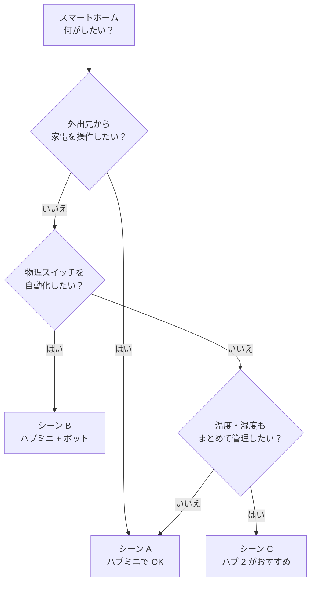

+++
date = '2026-02-28'
lastmod = '2026-02-28'
draft = false
title = 'SwitchBot おすすめはどれ？子育て家庭のスマートホーム入門'
style = 'D'
description = 'SwitchBot のハブミニ・ハブ 2・ボット Charge をシーン別に比較。5,000円以下で始められるスマートホームの選び方を初心者向けに解説します。'
slug = 'switchbot-smart-home'
image = 'cover.jpg'
categories = ['まとめ']
tags = ['スマートホーム', 'SwitchBot', 'スマートリモコン', 'IoT', '子育て', '時短家電']
keywords = ['SwitchBot おすすめ', 'SwitchBot ハブミニ', 'スマートホーム 初心者', 'SwitchBot ハブ2', 'SwitchBot ボット', 'スマートリモコン おすすめ', 'スマートホーム 子育て', 'SwitchBot 比較']
+++

※この記事にはアフィリエイト広告が含まれています。

## スマートホームって何？── 要するに「リモコンの統一」です

スマートホームって聞くとなんだか大がかりなイメージがありますけど、要するに **「家中のリモコンをスマホ 1台にまとめる」** だけの話です。テレビ、エアコン、照明……リモコンって気づくと増えてますよね。

SwitchBot は、そのリモコン統一をいちばん手軽にやってくれるメーカーです。一番安いモデルで 5,000円以下、工事も不要。買ってアプリを入れて、Wi-Fi につなぐだけ。最近はスマートホームを始める人がかなり増えていて、SwitchBot は楽天市場のスマートリモコン部門でも常にランキング上位に入っています。

<!-- TODO: 実体験 — スマートホーム導入のきっかけ、リモコン多すぎ問題 -->

ただ、SwitchBot って製品ラインナップがめちゃくちゃ多いんですよね。ハブミニ、ハブ 2、ハブ 3、ボット、カーテン、テープライト……初めて見ると「結局どれを買えばいいの？」ってなります。

この記事では、**子育て家庭で使うことを想定して**、シーン別に「これを買えば OK」というのを整理しました。全部 1万円以下で始められる組み合わせなので、気軽に読んでみてください。

## あなたに合うのはどれ？── シーン別診断チャート

まずはこのチャートで、自分に合うパターンを確認してみてください。

| シーン | やりたいこと | 必要なもの | 予算目安 |
|:---:|---------|---------|:---:|
| A | 外出先からエアコン ON | ハブミニ 1台 | 約 4,800円 |
| B | 照明スイッチを遠隔 OFF | ハブミニ + ボット | 約 10,300円 |
| C | 温湿度もまとめて管理 | ハブ 2 | 約 7,900円 |

ぶっちゃけ **迷ったらシーン A のハブミニ 1台からで OK** です。あとから製品を足していけばいいだけなので、最初から全部揃える必要はないですよ。

## シーン A: 帰宅前にエアコンをつけておきたい ── ハブミニ 1台で完結

**こんな人向け**: 共働きで帰宅が遅い、子どもを連れて帰ると部屋が暑い（寒い）、とりあえず手軽に始めたい。

必要なのは  だけです。これ 1台で赤外線リモコンがある家電をまとめてスマホから操作できるようになります。エアコンはもちろん、テレビ、シーリングライト、扇風機なんかも OK。


保育園のお迎えに出る前にアプリからエアコン ON → 帰宅したら部屋がちょうどいい温度。真夏と真冬はこれだけでかなり助かります。


サイズは 65×65×20mm で、手のひらにすっぽり収まるコンパクトさです。USB-C 給電なのでコンセントを占有しないのも地味にうれしいポイントですね。

ちなみに「Matter 対応」というのは、Apple の HomeKit や Google Home など **メーカーを超えた共通規格に対応している** という意味です。将来的に他ブランドの製品を買い足しても一緒に使えるので、ハブミニを選んでおけば後悔しにくいかなと。

Alexa にも Google アシスタントにも対応しているので、スマートスピーカーを持っている人なら声で操作もできます。ただスマートスピーカーがなくてもスマホだけで全然使えるので、なくても大丈夫です。

<!-- TODO: 実体験 — ハブミニの設定の簡単さ、実際にエアコンを操作した感想 -->



## シーン B: 寝かしつけ後に照明を消したい ── ハブミニ + ボット Charge

**こんな人向け**: 赤ちゃんの寝かしつけ後にリビングの照明を消しに行きたくない、壁スイッチしかない照明をスマート化したい。

リモコンで操作できる照明ならハブミニだけでいいんですけど、**壁スイッチしかない照明** ってありますよね。廊下とか洗面所とか。ここを自動化してくれるのが  です。

要するに **「指の代わりにスイッチを押してくれる小さいロボット」** ですね。壁スイッチに付属の両面テープで貼り付けて、アプリからポチっとするとアームが動いてスイッチを物理的に押してくれます。アナログな仕組みですけど、だからこそ古い照明でもスマート化できるのがいいところです。


2月16日に発売されたばかりの新型「ボット Charge」は USB-C 充電式。従来モデルは電池交換が必要でしたが、充電式になったのでランニングコスト 0円です。フル充電で約 6ヶ月持つので、半年に 1回ケーブルを挿すだけ。


子育て世帯だとこんな使い方が便利です。

- 寝かしつけ後にリビングの照明をオフ（赤ちゃんを起こさず移動不要）
- タイマーで朝の照明を自動 ON（子どもの生活リズムづくりに）
- お風呂の給湯パネルをリモートで操作

おすすめしない使い方としては、防水じゃないので **屋外のスイッチには使わないほうがいい** です。テラスとか庭の照明に使いたくなりますけど、雨に濡れたら壊れます。

価格は 5,480円。ハブミニとセットで **約 10,300円** と 1万円はちょっと超えますが、壁スイッチ問題を解決できるのはコレしかないので、必要な人には間違いなくアリです。

<!-- TODO: 実体験 — ボットの取り付け、動作音、実際の使い勝手 -->



## シーン C: 部屋の温湿度をまとめて管理したい ── ハブ 2

**こんな人向け**: 赤ちゃんの部屋の温度が気になる、エアコンを温度連動で自動運転させたい、センサー類もまとめて 1台で済ませたい。

ハブミニの上位モデルが  です。リモコン機能に加えて、**温湿度計と照度センサーが内蔵** されています。

たとえば以下のような自動化ができます。

- 室温が 28℃ を超えたら自動でエアコン ON
- 湿度が 40% を切ったら加湿器 ON
- 部屋が暗くなったらテープライトを自動点灯

特に赤ちゃんがいる家庭だと、「部屋の温度大丈夫かな」って外出中に気になりますよね。ハブ 2 ならアプリでリアルタイムに温湿度を確認できるので、安心感が全然違います。


上位モデル「ハブ 3」（¥14,980）もありますが、2.4 インチ画面や CO2 表示など「あったら便利だけど必須ではない」機能が追加されたモデルです。コスパで選ぶならハブ 2 で十分ですね。ディスプレイで温湿度を確認できるのは同じですし、赤外線の到達距離も実用上は変わりません。


本体にディスプレイがついているので、アプリを開かなくても温湿度をパッと確認できるのもいいんですよね。温湿度計を別で買うことを考えると、ハブミニとの **差額約 3,100円でセンサー付き** になるのはかなりお得です。

逆にこんな人にはハブ 2 は合わないかもしれません。「温度とか湿度はべつに気にしない、エアコンを遠隔操作できればそれでいい」という人にはオーバースペックです。素直にハブミニでいいと思います。

<!-- TODO: 実体験 — ハブ 2 の温湿度管理、自動化設定の使い勝手 -->



## SwitchBot ハブ 3モデル比較 ── 予算で選ぶならどれ？

ここまで紹介した 3モデルのスペックを並べてみます。

{{< product-comparison title="SwitchBot ハブ スペック比較" p1-name="ハブミニ" p1-img="https://thumbnail.image.rakuten.co.jp/@0_mall/switchbot/cabinet/09377790/11880636/11880637/imgrc0089787174.jpg?_ex=256x256" p1-price="4,780" p1-badge="コスパ最強" p1-specs="リモコン操作:○|温湿度センサー:×|ディスプレイ:×|Matter 対応:○|サイズ:65×65×20mm" p2-name="ハブ 2" p2-img="https://thumbnail.image.rakuten.co.jp/@0_mall/switchbot/cabinet/09377790/09563522/imgrc0078660079.jpg?_ex=256x256" p2-price="7,880" p2-badge="バランス型" p2-specs="リモコン操作:○|温湿度センサー:○|ディスプレイ:○|Matter 対応:○|サイズ:80×70×23mm" p3-name="ハブ 3" p3-price="14,980" p3-badge="全部入り" p3-specs="リモコン操作:○|温湿度センサー:○|ディスプレイ:○（2.4型）|Matter 対応:○|サイズ:80×80×25mm" highlight="1" >}}

そうそう、**ハブ系はどれか 1台あれば OK** です。複数買う必要はありません。

- **安くスタートしたい** → ハブミニ
- **温湿度も見たい** → ハブ 2
- **フラッグシップが欲しい** → ハブ 3

こういうシンプルな選び方で大丈夫です。


ハブミニ（¥4,780）+ テープライト（¥2,533）= 約 7,300円。間接照明をスマホで操作できるようになるので、見た目の変化もあってスマートホームの楽しさを実感しやすいです。


## よくある質問 ── 買う前に気になるポイント

### スマートスピーカーがないと使えない？

**いいえ、スマホだけで使えます。** Alexa や Google Home があれば声で操作もできますが、必須ではありません。SwitchBot アプリだけで全機能使えるので、スマートスピーカーは「あったら便利」くらいの位置づけです。

### 賃貸でも設置できる？

**できます。** SwitchBot の製品はすべて工事不要で、両面テープや置くだけで設置できます。引っ越しのときもそのまま持っていけるので、賃貸でも一戸建てでも問題ありません。

### Wi-Fi が不安定でも大丈夫？

**Bluetooth にも対応** しているので、近距離なら Wi-Fi なしでも操作できます。ただし外出先からの遠隔操作には Wi-Fi 接続が必要です。一戸建てで Wi-Fi が届きにくい部屋がある場合は、メッシュ Wi-Fi ルーターの導入を検討してみてください。

## まとめ ── まずはハブミニ 1台から始めてみよう

スマートホームって名前こそ大げさですけど、やっていることは **「リモコンをスマホに集約する」だけ** です。SwitchBot ならハブミニ 1台 4,780円から始められて、工事もいらない。30分もあればセットアップ完了です。



おすすめの始め方はこのとおりです。

1. **とりあえず始めたい** → ハブミニ 1台（¥4,780）
2. **壁スイッチも操作したい** → ハブミニ + ボット Charge（約 ¥10,300）
3. **温湿度管理もしたい** → ハブ 2（¥7,880）

まずハブミニ 1台で「外出先からエアコンをつける」体験をしてみるのがいいかなと思います。これだけでも「あ、便利じゃん」ってなるはずです。そこから必要に応じてボットやセンサーを足していけばいいので、焦って全部揃える必要はないですよね。



スマートホームで家電をまとめて操作するようになると、通信費も見直したくなってきます。スマホのプラン変更を考えているなら、[楽天モバイルに乗り換えた感想をまとめた記事](/posts/rakuten-mobile-review/)も参考にしてみてください。



ロボット掃除機もスマートホームと相性がいいですよね。SwitchBot のスケジュール機能と組み合わせると、家事の自動化がさらに進みます。[ルンバ ミニの解説記事](/posts/roomba-mini/)もチェックしてみてください。

花粉シーズンに空気清浄機や加湿器をスマート化するなら、[在宅ワーカーの花粉対策まとめ](/posts/remote-work-pollen/)も合わせてどうぞ。ハブ 2 の温湿度連動と組み合わせると効果的です。

※2026年2月時点の情報です。価格は変動する場合があります。