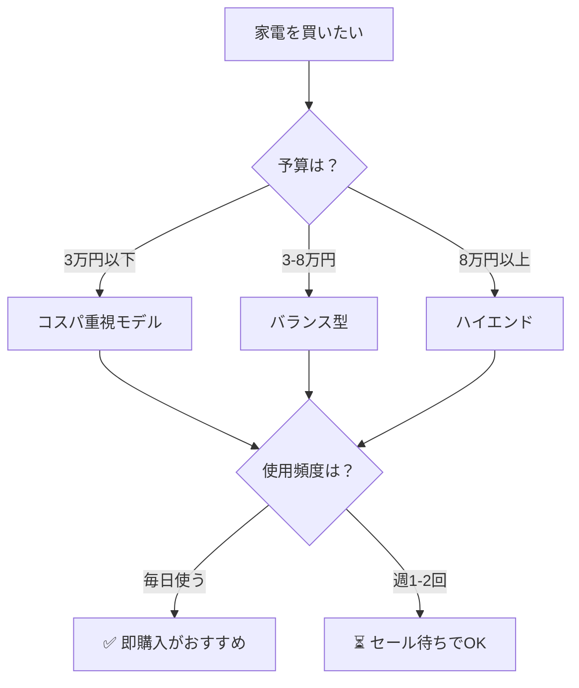
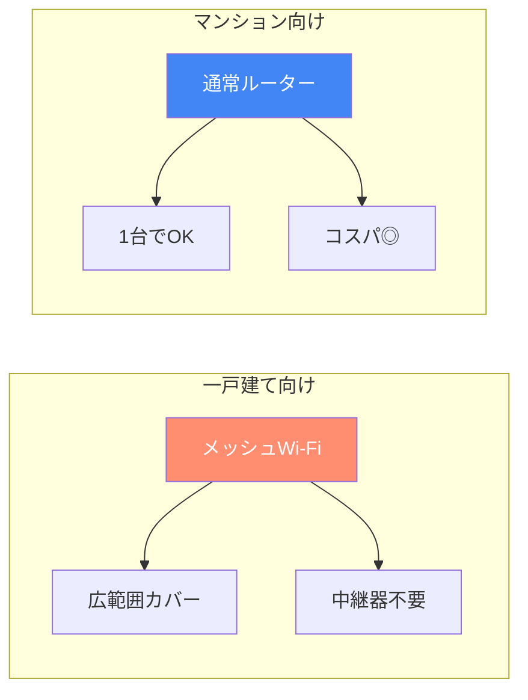
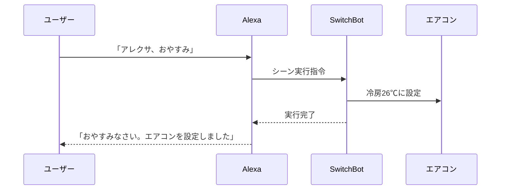
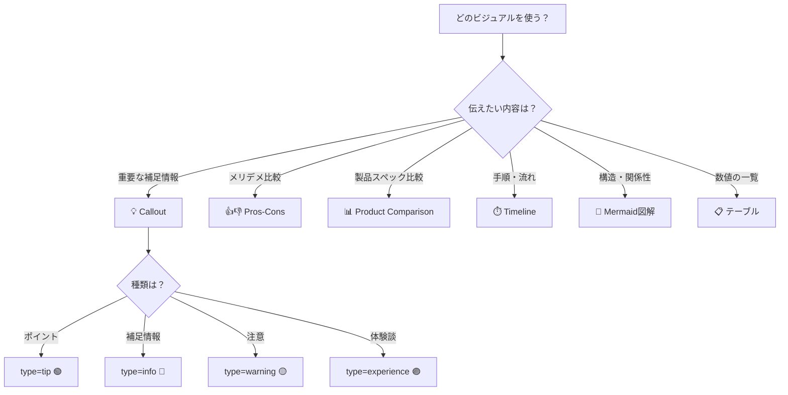

---
title: "【サンプル】ビジュアル要素ショーケース"
slug: "visual-sample"
date: 2026-02-23T00:00:00+09:00
draft: true
description: "callout・pros-cons・product-comparison・Mermaid・timeline など、記事で使えるビジュアル要素を一覧で確認するためのサンプルページです。"
categories:
  - 解説
tags:
  - サンプル
image: ""
---

この記事は、ブログで使える**ビジュアル要素（ショートコード・図解）**をすべて並べて見比べるためのサンプルです。既存記事には影響しません（`draft: true`）。

---

## 1. Callout（コールアウト）ショートコード

テキストの壁を分断し、重要な情報を目立たせるボックスです。5種類のタイプがあります。

### 💡 tip（ポイント）


フルリモートで8時間座りっぱなしの自分が実感したポイントです。腰痛対策には休憩のタイミングより「座面の高さ」が重要でした。


### ℹ️ info（メモ）


楽天スーパーセールは3月・6月・9月・12月の年4回開催されます。ポイント還元率が通常の10倍以上になることもあるので、大型家電はこのタイミングがおすすめです。


### ⚠️ warning（注意）


0歳の赤ちゃんがいる家庭では、小さな部品が取り外せるタイプの製品は誤飲リスクがあります。購入前に必ず対象年齢を確認してください。


### 🚨 danger（重要）


リチウムイオンバッテリーの膨張が確認された場合は、絶対に使用を続けないでください。すぐにメーカーサポートに連絡しましょう。


### 🗣️ experience（体験談）


5歳の上の子が「これ何？」と触りたがるので、チャイルドロックは必須でした。実際に子供が操作パネルを連打しても反応しないのを確認して安心しました。


### カスタムタイトル付き


LDK 20畳で空気清浄機を使った場合、PM2.5 の数値が30分で半分以下に。一戸建ては気密性が高いので、一度きれいにすると持続しやすいです。


---

## 2. Pros-Cons（メリット・デメリット）ショートコード

商品のメリット・デメリットを一目で視覚的に比較できるカードです。

### 基本パターン



### カスタムヘッダー



---

## 3. Product Comparison（商品比較）ショートコード

商品の画像・価格・スペックを横並びで比較できるカードです。

### 3商品比較（おすすめハイライト付き）

{{< product-comparison
  title="ロボット掃除機 主要3モデル比較"
  p1-name="ルンバ コンボ j9+"
  p1-img="https://thumbnail.image.rakuten.co.jp/@0_mall/irobotstore/cabinet/j9combo/j9combo_01.jpg?_ex=256x256"
  p1-price="139,800"
  p1-specs="吸引力:2倍(従来比)|水拭き:対応|ナビ:iAdapt 3.0|サイズ:33.9cm|重量:3.4kg|稼働時間:最大120分"

  p2-name="Roborock S8 Pro Ultra"
  p2-img="https://thumbnail.image.rakuten.co.jp/@0_mall/roborock/cabinet/s8proult/s8proult_main.jpg?_ex=256x256"
  p2-price="179,800"
  p2-badge="⭐ おすすめ"
  p2-specs="吸引力:6000Pa|水拭き:振動式|ナビ:LiDAR|サイズ:35.0cm|重量:3.7kg|稼働時間:最大180分"

  p3-name="ECOVACS DEEBOT X2"
  p3-img="https://thumbnail.image.rakuten.co.jp/@0_mall/ecovacs/cabinet/x2/x2_main.jpg?_ex=256x256"
  p3-price="149,800"
  p3-specs="吸引力:8000Pa|水拭き:回転式|ナビ:LiDAR+カメラ|サイズ:32.0cm|重量:3.6kg|稼働時間:最大210分"

  highlight="2"
>}}

### 2商品比較



---

## 4. Mermaid 図解（テーマ標準機能）

コードブロックに `mermaid` を指定するだけで自動レンダリングされます。新しいコードやスクリプトは不要です。

### フローチャート

### 比較チャート

### シーケンス図（スマートホームの動作フロー）

---

## 5. Timeline（タイムライン）ショートコード

手順やステップを時系列で表現するのに使います。

### セットアップ手順の例



**開封・内容物チェック**: 本体、充電ステーション、サイドブラシ×2、フィルター、電源ケーブルが入っていることを確認します。



**充電ステーションの設置**: 壁際に設置し、左右50cm・前方1.5m以上のスペースを確保。電源ケーブルを接続します。



**アプリのインストール**: スマホで専用アプリをダウンロード。Bluetooth → Wi-Fi の順で接続設定を行います（所要時間：約3分）。



**初回マッピング走行**: 「全部屋を掃除」をタップ。部屋全体を走行してマップを自動生成します（広さにより10〜30分）。



**日常使いスタート**: マップが完成したら、部屋ごとの掃除スケジュールや禁止エリアを設定できるようになります。



---

## 6. Markdown テーブル（標準機能）

通常のMarkdownテーブルも記事では有効なビジュアル要素です。

| 項目 | ルンバ j9+ | Roborock S8 | ECOVACS X2 |
|------|:----------:|:-----------:|:----------:|
| 吸引力 | ★★★★☆ | ★★★★★ | ★★★★★ |
| 静音性 | ★★★★★ | ★★★★☆ | ★★★☆☆ |
| アプリ | ★★★★☆ | ★★★★★ | ★★★★☆ |
| 価格 | ★★★☆☆ | ★★☆☆☆ | ★★★☆☆ |
| **総合** | **4.0** | **4.3** | **3.8** |

---

## 7. 組み合わせ例：実際の記事で使うイメージ

ここからは、上記のビジュアル要素を**実際の記事の流れ**で使った場合のイメージです。

### テキストだけの場合（Before）

ルンバ コンボ j9+ は吸引力が従来モデルの約2倍で、水拭きにも対応しています。稼働音は40dB以下なので、赤ちゃんが寝ているときでも使えます。アプリで外出先からも操作でき、自動ゴミ収集ステーションも付いています。ただし本体価格は5万円台とやや高めで、ダストボックスの手入れが月1回必要です。また黒い本体は部屋によっては目立ちます。

### ビジュアル要素を使った場合（After）

ルンバ コンボ j9+ を実際に我が家で1ヶ月使ってみました。


5歳の上の子が「ルンバちゃん動いてる！」と大喜び。0歳の下の子が昼寝中でも使える静音性は、子育て家庭には本当にありがたいです。





楽天スーパーセール（3月・6月・9月・12月）のタイミングなら、ポイント還元で実質4万円台に。お買い物マラソンとの併用もおすすめです。


---

## 8. ビジュアル要素の選び方ガイド

---

## まとめ

| ビジュアル要素 | 最適な用途 | 対応スタイル |
|-------------|-----------|:----------:|
| Callout | 補足情報・注意書き・体験談 | 全スタイル |
| Pros-Cons | 商品のメリット・デメリット | A / C / E |
| Product Comparison | 製品スペック比較 | A / C |
| Mermaid | 構造・フロー・関係性 | F / B |
| Timeline | 手順・セットアップ | B / E / F |
| テーブル | 数値データ・一覧 | 全スタイル |