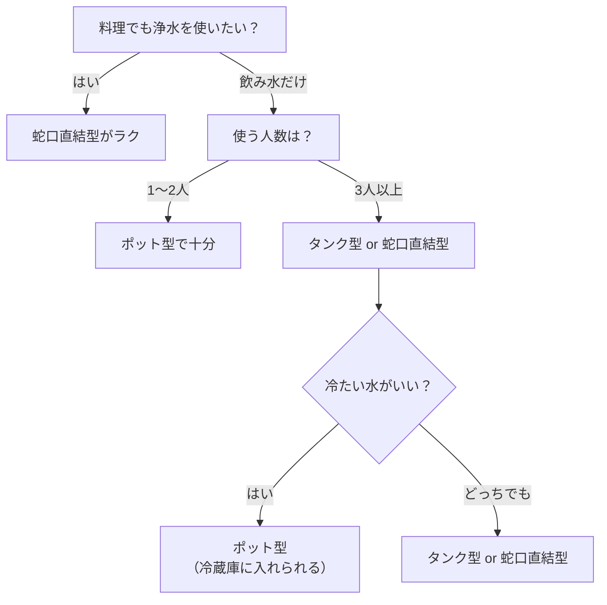
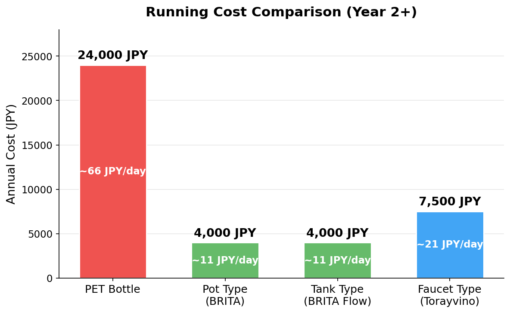

---
title: "浄水器の選び方ガイド｜5種類の違いとコストを比較"
date: 2026-02-22T00:00:00+09:00
lastmod: 2026-02-23T00:00:00+09:00
draft: false
categories: ["解説"]
tags: ["浄水器", "選び方", "ポット型", "タンク型", "蛇口直結型", "お役立ち"]
description: "浄水器の選び方を初心者向けに解説。ポット型・タンク型・蛇口直結型など5種類の違い、年間ランニングコスト比較、フィルター交換の注意点まで。自分に合うタイプがわかります。"
slug: "water-purifier-guide"
style: "F"
image: cover.jpg
ShowToc: true
TocOpen: true
---

※この記事にはアフィリエイト広告が含まれています。

## 浄水器、種類が多すぎて選べない問題

浄水器って、調べ始めるとポット型・蛇口型・据え置き型…と種類が多すぎて「結局どれがいいの？」ってなりませんか。

自分も最初は「水道水で別に困ってないけど、なんかカルキ臭いな…」くらいの動機で調べ始めたんですけど、種類ごとにコストも使い勝手も全然違うことがわかって驚きました。よくわからないまま買うと、合わなくて使わなくなるパターンもあるので注意です。

この記事では、浄水器の種類ごとの違い・選び方・ランニングコストまで、初めて買う人向けにまとめています。

---

## そもそも浄水器って必要？水道水との違い

結論から言うと、日本の水道水はそのまま飲んでも安全です。[厚生労働省が定める水道水質基準](https://www.mhlw.go.jp/stf/seisakunitsuite/bunya/topics/bukyoku/kenkou/suido/kijun/kijunchi.html)は51項目にもおよび、WHO（世界保健機関）のガイドラインにも準拠した世界トップクラスの厳しさです。ちなみに、国土交通省の資料によると、水道水をそのまま飲める国は世界で約15ヵ国のみ。日本の水道がいかに恵まれているかがわかります。

じゃあ浄水器いらないじゃん、って話なんですけど、**安全と「おいしい」は別問題**なんですよね。

水道水には消毒用の残留塩素（いわゆるカルキ）が含まれていて、これが独特のにおいや味の原因になっています。慣れてると気づかないんですけど、浄水器を通した水と飲み比べると「あ、全然違う」ってなります。自分も最初は半信半疑でしたが、一度使うと水道水そのままには戻れなくなりました。

「じゃあペットボトルの水を買えばいいのでは？」と思うかもしれませんが、毎日飲む量で考えるとコストが結構かかります。2Lペットボトルを月20本くらい買うと、年間で2万円前後。浄水器のほうがランニングコストはかなり抑えられます（詳しくは後半で比較します）。

---

## 浄水器にはどんな種類がある？

大きく分けるとポット型・タンク型・蛇口直結型・据え置き型・ビルトイン型の5タイプです。それぞれ価格も浄水性能も全然違います。

浄水器は大きく分けると以下の5タイプがあります。

| タイプ | 価格帯 | 浄水スピード | フィルター寿命 | 設置の手軽さ | 向いている人 |
|:---:|:---:|:---:|:---:|:---:|:---|
| ポット型 | 2,000〜5,000円 | ゆっくり（数分） | 2〜3ヶ月 | ◎ 買ってすぐ | 一人暮らし・まず試したい人 |
| タンク型 | 3,000〜6,000円 | ゆっくり（数分） | 2〜3ヶ月 | ◎ 買ってすぐ | 家族世帯・まとめて浄水したい人 |
| 蛇口直結型 | 3,000〜10,000円 | 速い（そのまま出る） | 2〜4ヶ月 | ○ 蛇口に取り付け | 料理にも使いたい家庭 |
| 据え置き型 | 15,000〜50,000円 | 速い | 6ヶ月〜1年 | △ スペース必要 | 浄水性能にこだわりたい人 |
| ビルトイン型 | 50,000円〜＋工事費 | 速い | 1年前後 | × 工事必須 | 新築・リフォーム時に |

ざっくり言うと、**手軽さ重視ならポット型・タンク型・蛇口直結型、性能重視なら据え置き型以上**という感じです。

**ポット型**は冷蔵庫に入れておくだけ。などが定番ですね。設置ゼロですぐ使えるのが最大のメリットですが、浄水に数分かかるのと、容量が1L前後なので家族だとこまめに補充が必要です。

**タンク型**はポット型の大容量版。が代表的で、容量が4L以上あるのでキッチンに置いておけば家族で使っても頻繁に補充しなくて済みます。冷蔵庫には入らないサイズなので、常温で使う前提になります。実際に使ってみた感想は[BRITA Flowのレビュー記事](/posts/brita-water-purifier/)にまとめています。

**蛇口直結型**は蛇口の先端にカチッと取り付けるタイプ。やが定番です。蛇口をひねればそのまま浄水が出るので、料理にもガンガン使えます。

**据え置き型**はシンク横に本体を置くタイプ。フィルターが大きい分、浄水性能は高いです。ただしキッチンのスペースを取るので、置き場所の確保が必要になります。

**ビルトイン型**はシンク下に埋め込むタイプで、見た目はスッキリしますが工事が必要です。新築やリフォームのタイミングじゃないと現実的には厳しいですね。

初めて浄水器を買うなら、**まずはポット型・タンク型・蛇口直結型の3択で考える**のがおすすめです。次のセクションでこのあたりを詳しく比べます。

---

## ポット型と蛇口型、結局どっちがいい？

「で、自分にはどっちがいいの？」という話ですが、以下のフローチャートで考えるとシンプルです。


2,000〜3,000円くらいで買えるので、合わなくても痛くないです。自分も最初にを買って「あ、浄水ってこんなに違うんだ」と実感してから、料理にも使いたくなって蛇口直結型に切り替えました。いきなり高いのを買うより、段階的に試すほうが失敗しにくいです。


---

## ランニングコストはどれくらい違う？

結論、ペットボトルと比べて年間1万円以上差が出ます。浄水器を選ぶとき、本体価格だけ見て決めるのはもったいないです。**長く使うものだからこそ、ランニングコストで比べる**のが大事。

家族4人で1日2L使う想定で、年間コストを比較してみました。

| 方式 | 初年度コスト | 2年目以降 | 1日あたり（2年目〜） |
|:---:|:---:|:---:|:---:|
| ペットボトル（2L） | 約24,000円 | 約24,000円 | 約66円 |
| ポット型（BRITA） | 約7,000円 | 約4,000円 | 約11円 |
| タンク型（BRITA Flow） | 約8,000円 | 約4,000円 | 約11円 |
| 蛇口直結型（トレビーノ等） | 約12,500円 | 約7,500円 | 約21円 |

※金額はすべて目安です。購入先・時期によって変動します。ポット型・タンク型はBRITAのMAXTRA PRO（マクストラプロ）カートリッジ（年4回交換）で試算。蛇口直結型はカートリッジ年3回交換で試算。ポット型とタンク型は同じカートリッジを使うため、ランニングコストは同額になります。

ペットボトルと比べると、浄水器は**年間で1万円以上の差**が出ます。しかも2年目以降は本体代がなくなるので、使い続けるほどおトクになる構造です。

うちはを使っていますが、カートリッジ代は月300円ちょっと（[詳しいコスト内訳はこちら](/posts/brita-water-purifier/#brita-flowのランニングコスト)）。ペットボトルを箱買いしてた頃と比べると、ゴミの量も激減しました。地味にこっちのメリットのほうが大きかったりします。重いペットボトルを玄関から運ぶ作業がなくなったのも助かってます。

---

## フィルター交換をサボるとどうなる？

浄水性能が落ちるだけでなく、雑菌が繁殖して水道水より不衛生になるリスクがあります。浄水器を買ったら終わりじゃなくて、**フィルター（カートリッジ）の交換が一番大事**です。ここを適当にすると、浄水器をつけてる意味がなくなります。

フィルターは使い続けると浄水性能が徐々に落ちていきます。活性炭やイオン交換膜が不純物を吸着する仕組みなので、吸着できる量には限界があるんですよね。


使用期限を大幅に過ぎたフィルターをそのまま使い続けると、フィルター内部に溜まった不純物をエサに雑菌が繁殖し、**水道水をそのまま飲むより不衛生になる可能性**があります。「浄水器つけてるから安心」と思いがちですが、交換をサボると逆効果です。


### 交換時期の見分け方

メーカーが指定する交換目安はあくまで「1日○L使用した場合」の計算です。家族の人数や使用量で実際の寿命は変わります。

- **BRITAのポット・タンク型**: 液晶メモ（スマートライト）が交換時期を教えてくれます。これが点滅したら素直に交換
- **蛇口直結型**: 浄水量カウンター付きのモデルなら残量表示あり。ないモデルは期間で管理

最近のモデルは交換時期を本体が教えてくれるものが多いので、表示に従って交換すればOKです。表示機能がないモデルの場合は、スマホのカレンダーにリマインダーを入れておくと安心ですね。

---

## まとめ：浄水器選びで失敗しないコツ

浄水器選びのポイントをまとめると、この3つです。

- **種類を知る**: ポット型・タンク型・蛇口直結型・据え置き型・ビルトイン型の5タイプ。初心者はポット型・タンク型・蛇口直結型から選ぶのが無難
- **生活スタイルに合わせる**: 飲み水だけならポット型・タンク型、料理にも使うなら蛇口直結型。家族の人数と使い方で決まります
- **カートリッジ交換を忘れない**: 浄水器は「買って終わり」じゃないです。リマインダー設定が地味に大事

難しく考えなくても、まずは手軽なものから試してみて、合わなければ変えればOK。自分に合うタイプが見つかると、毎日の水がちょっと快適になりますよ。

具体的に「タンク型ってどうなの？」と気になった方は、こちらの記事も参考にしてみてください。

👉 [BRITA Flowレビュー｜水道水のカルキ臭が消えた話](/posts/brita-water-purifier/)

※2026年2月時点の情報です。

ちなみにうちで使っている BRITA Flow のレビューは[こちらの記事](/posts/brita-water-purifier/)に書いています。タンク型が気になっている方は参考にしてみてください。