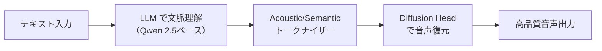

※この記事にはアフィリエイト広告が含まれています。

「VibeVoice」って名前、最近ちょこちょこ見かけませんか？ AI 音声合成の話をしていると必ずと言っていいほど出てくるようになったMicrosoftのモデルです。

この記事では、**VibeVoiceとは何か・何がすごいのか・どう使うのか**をざっくりまとめます。

## VibeVoiceとは？

**VibeVoice（VibeVoice-1.5B）は、Microsoftが2025年8月にオープンソースで公開した音声合成（TTS：Text-to-Speech）AIモデルです。** テキストを入力すると、まるで人が話しているような自然な音声を生成できます。

従来のTTSと一線を画すのは「長尺・複数話者対応」という点。最大90分、最大4人の話者による会話音声を一度に生成できます。ポッドキャストやオーディオブックの自動制作を想定して設計されています。

MITライセンスで公開されているため、個人利用はもちろん商用目的での利用・改変も基本的に可能です。


モデル名の「1.5B」はパラメータ数（15億）を表しています。大規模言語モデル（LLM）の世界では比較的コンパクトな部類で、一般的なGPU（VRAM 8GB以上）でも動作します。


## VibeVoiceの主な特徴

### 最大90分・4人の会話を一度に生成できる

これが一番のインパクトです。従来の音声合成ツールは「1文〜数分程度」が現実的な上限で、長尺コンテンツを作ろうとすると何度も分割処理が必要でした。

VibeVoiceなら**ポッドキャスト1エピソード分をまるごと生成**できます。複数の話者が自然に発話を切り替える「ターンテイキング」まで再現してくれるので、台本を書けばそのまま音声化できるイメージです。

### 人間らしいイントネーションと感情表現

従来のTTSにありがちな「棒読み感」がほぼありません。

Microsoftの技術解説によると、「next-token diffusion」という手法を採用することで、長文でも自然なリズムや感情の起伏を維持できるとのこと。実際に生成した音声を聴くと「これ本当にAI？」となる人が多いです。

### 仕組みはざっくり3段階



1. **LLM（Qwen 2.5）で文脈・意図を理解**
2. **音響特徴と意味特徴を2段階で抽出**（Acoustic Tokenizer + Semantic Tokenizer）
3. **Diffusion Headがノイズから高品質音声を復元**

ちなみに豆知識なんですけど、この「Diffusion」というアプローチ、画像生成AI（Stable Diffusionなど）と同じ考え方が音声にも応用されているんですよね。

## VibeVoiceはどうやって使う？

### 動作環境の目安

| 項目 | 最小要件 |
|------|---------|
| GPU | VRAM 8GB以上（RTX 3060相当〜） |
| OS | Linux / macOS（WindowsはWSL2経由） |
| Python | 3.10以上 |

VRAM 8GBはゲーミングPCに搭載されているミドルクラスのGPUと同等です。クラウド環境（Google ColabのA100など）でも動作確認されています。

### 基本的な流れ

まずGitHubからリポジトリを取得して、テキストファイルを用意するだけです。

```bash
# リポジトリを取得
git clone https://github.com/microsoft/VibeVoice.git

# 依存ライブラリをインストール
pip install -r requirements.txt

# 推論を実行（1人の話者の例）
python demo/inference_from_file.py \
  --model_path microsoft/VibeVoice-1.5B \
  --txt_path demo/text_examples/1p_abs.txt \
  --speaker_names Alice
```

テキストファイルは `Speaker 1: こんにちは` のような会話形式で書きます。複数話者なら `--speaker_names Alice Carter` のようにスペース区切りで指定します。

実行後は `outputs/` フォルダに `.wav` ファイルが生成されます。


ComfyUI用のカスタムノード（ComfyUI-VibeVoiceなど）を導入すると、画像生成AIと同じGUI環境で音声合成もできます。コマンドラインが苦手な人にはこちらのほうが手軽かもしれません。


## 日本語への対応状況は？

**現時点での公式対応言語は英語と中国語のみです。** 日本語は公式にはサポートされていません。

ただし、試した人の報告を見ると「漢字をひらがな・カタカナに変換してから入力すると、ある程度日本語らしい音声になる」という工夫が有効なようです。完全な日本語ナレーションとしては使えないレベルですが、実験的に試してみる分には面白いかもしれません。


公式サポート外のため、品質保証はありません。高品質な日本語TTSが必要な場合は、VOICEVOXやCoeFont、Google Text-to-Speechなど専用モデルの利用を検討してください。


## よくある勘違い

### 「無料＝制限なし」ではない

MITライセンスで「無料・商用OK」なのは本当です。ただし、Microsoftは利用ガイドラインとして「なりすまし・偽情報生成・リアルタイムディープフェイク用途への使用禁止」を明記しています。

ライセンスの話と倫理的な利用ルールは別の話なので、使う前に一度ガイドラインを確認しておくのが無難です。

### 「90分生成できる＝高速」ではない

一度に90分の音声を生成できますが、生成自体に相応の時間がかかります。RTX 3080相当のGPUで数分〜十数分程度が目安と言われています。リアルタイム音声変換には向きません。

## まとめ

VibeVoiceは「長尺・複数話者・自然な表現」という点で、従来のTTSモデルと明確に差別化されたオープンソースAIです。

- **ポッドキャストやオーディオブックを自動生成したい人**には特に面白い選択肢
- **日本語は非公式対応**なので、本格的な日本語コンテンツ制作には別のツールも検討を
- MITライセンスで商用利用可、ただし利用ガイドラインは守ること

AIコンテンツ制作に興味が出てきた方は、まずはローカル環境やGoogle Colabで試してみるのが一番手っ取り早いです。

※2026年4月時点の情報です。AIモデルの仕様は更新されることがあります。最新情報はMicrosoftの公式GitHubをご確認ください。
